# Übersicht Widget Suite

A set of 12 widgets for [Übersicht](http://tracesof.net/uebersicht/) — now-playing
and music visuals, productivity tools, and ambient desktop pieces, all sharing one
design system. Each widget lives in its own repository (linked below).

[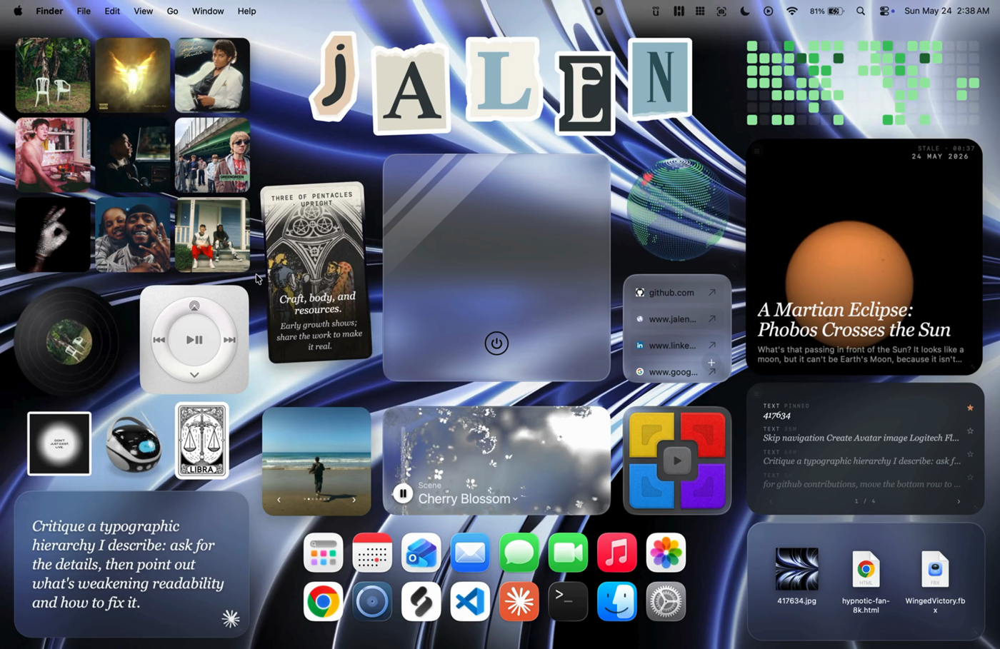](homescreen.mp4)

## Widgets

|     |     |     |
|:---:|:---:|:---:|
| <a href="https://github.com/jke48222/animated-wallpaper-widget"> <b>Animated Wallpaper</b></a> A full-screen live WebGL shader wallpaper that animates behind your other widgets. | <a href="https://github.com/jke48222/clipboard-history-widget">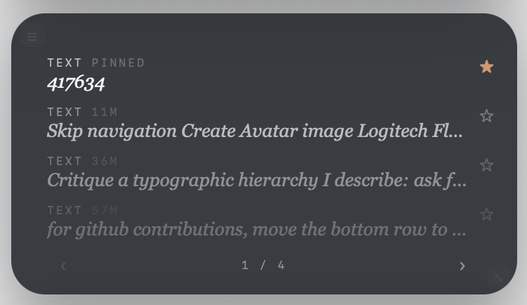 <b>Clipboard History</b></a> Your clipboard history as a depth-faded stack, with pinning, secret masking, and kind filters. | <a href="https://github.com/jke48222/daily-ai-prompt-widget">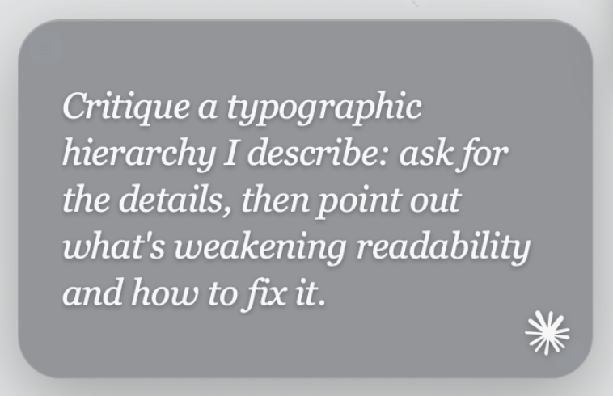 <b>Daily AI Prompt</b></a> One daily AI prompt on a frosted-glass panel; click to copy and open a new chat. |
| <a href="https://github.com/jke48222/daily-astronomy-photo-widget">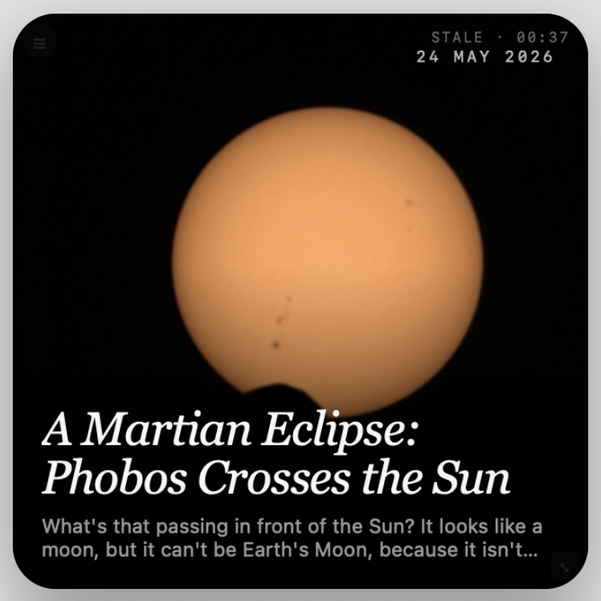 <b>Daily Astronomy Photo</b></a> NASA's Astronomy Picture of the Day, full-bleed, with inline video on .mp4 days. | <a href="https://github.com/jke48222/daily-tarot-widget">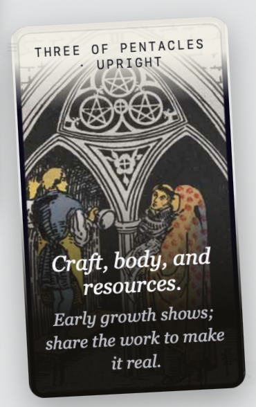 <b>Daily Tarot</b></a> A daily Rider-Waite-Smith tarot card with its upright/reversed reading. | <a href="https://github.com/jke48222/github-contributions-widget">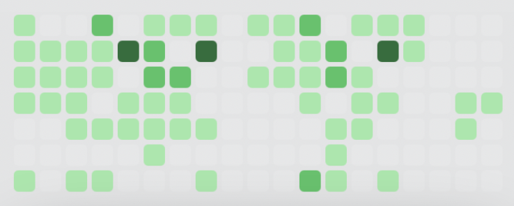 <b>GitHub Contributions</b></a> A GitHub contribution graph with current streak, yearly total, and per-day tooltips. |
| <a href="https://github.com/jke48222/now-playing-widget">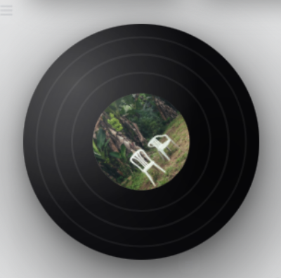 <b>Now Playing</b></a> The current track as a tilted, continuously spinning vinyl record. | <a href="https://github.com/jke48222/recent-album-covers-widget">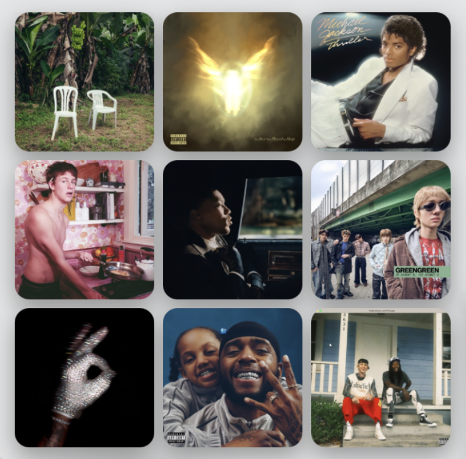 <b>Recent Album Covers</b></a> A 3x3 mosaic of the nine most-played albums in your Music library. | <a href="https://github.com/jke48222/recent-downloads-widget">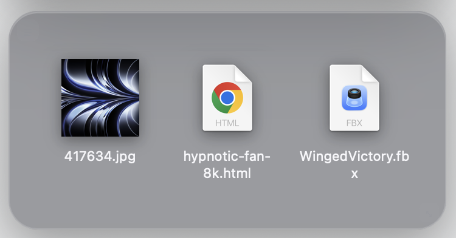 <b>Recent Downloads</b></a> The three most recent files in your Downloads folder with real macOS previews. |
| <a href="https://github.com/jke48222/rotating-3d-model-widget">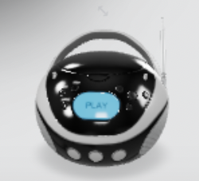 <b>Rotating 3D Model</b></a> A live, auto-rotating 3D PBR model that changes daily, with offline fallback. | <a href="https://github.com/jke48222/spinning-globe-widget">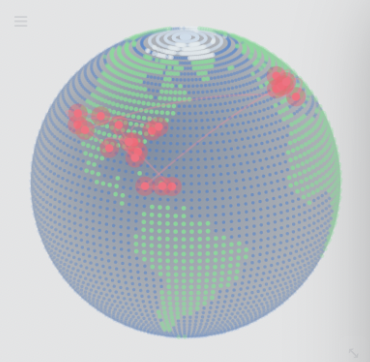 <b>Spinning Globe</b></a> A slowly spinning dot-matrix globe with arcs and a pin on every city you've visited. | <a href="https://github.com/jke48222/wallpaper-switcher-widget">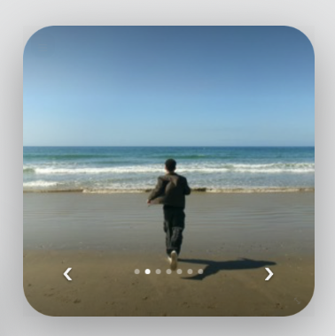 <b>Wallpaper Switcher</b></a> Browse and set your desktop wallpaper from ~/Pictures/Wallpapers. |

## Install

Each widget is its own repo. Open one, download its `*.widget.zip`, unzip into
`~/Library/Application Support/Übersicht/widgets/`, then refresh Übersicht
(menu bar icon -> Refresh All). Some widgets can optionally connect to the
Claude or Apple Music APIs — see each repo's README.

## Author

Jalen Edusei <jalen.edusei@gmail.com>
