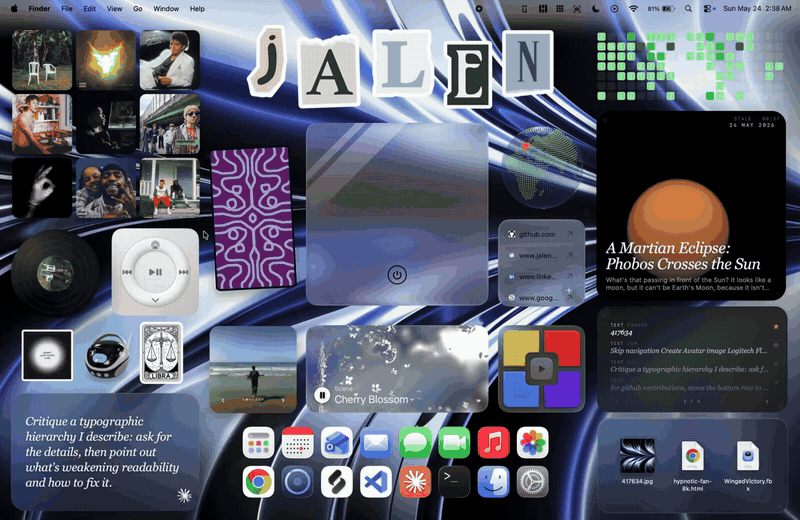

# Übersicht Widget Suite

[](LICENSE)  [](https://tracesof.net/uebersicht-widgets/)

[Übersicht gallery](https://tracesof.net/uebersicht-widgets/) · [Widgets](#widgets) · [Install](#install)

A set of 16 widgets for [Übersicht](http://tracesof.net/uebersicht/) — now-playing
and music visuals, productivity tools, and ambient desktop pieces, all sharing one
design system. Each widget lives in its own repository (linked below). The four newest, Agent Fleet, Keys & Pads, Pi Fleet, and Window Pet, are interactive or read live data; the rest are ambient.



[Full-resolution video](homescreen.mp4)

## Widgets

|     |     |     |
|:---:|:---:|:---:|
| <a href="https://github.com/jke48222/animated-wallpaper-widget"><br><b>Animated Wallpaper</b></a><br><sub>A full-screen live WebGL shader wallpaper that animates behind your other widgets.</sub> | <a href="https://github.com/jke48222/clipboard-history-widget"><br><b>Clipboard History</b></a><br><sub>Your clipboard history as a depth-faded stack, with pinning, secret masking, and kind filters.</sub> | <a href="https://github.com/jke48222/daily-ai-prompt-widget"><br><b>Daily AI Prompt</b></a><br><sub>One daily AI prompt on a frosted-glass panel; click to copy and open a new chat.</sub> |
| <a href="https://github.com/jke48222/daily-astronomy-photo-widget"><br><b>Daily Astronomy Photo</b></a><br><sub>NASA's Astronomy Picture of the Day, full-bleed, with inline video on .mp4 days.</sub> | <a href="https://github.com/jke48222/daily-tarot-widget"><br><b>Daily Tarot</b></a><br><sub>A daily Rider-Waite-Smith tarot card with its upright/reversed reading.</sub> | <a href="https://github.com/jke48222/github-contributions-widget"><br><b>GitHub Contributions</b></a><br><sub>A GitHub contribution graph with current streak, yearly total, and per-day tooltips.</sub> |
| <a href="https://github.com/jke48222/now-playing-widget"><br><b>Now Playing</b></a><br><sub>The current track as a tilted, continuously spinning vinyl record.</sub> | <a href="https://github.com/jke48222/recent-album-covers-widget"><br><b>Recent Album Covers</b></a><br><sub>A 3x3 mosaic of the nine most-played albums in your Music library.</sub> | <a href="https://github.com/jke48222/recent-downloads-widget"><br><b>Recent Downloads</b></a><br><sub>The three most recent files in your Downloads folder with real macOS previews.</sub> |
| <a href="https://github.com/jke48222/rotating-3d-model-widget"><br><b>Rotating 3D Model</b></a><br><sub>A live, auto-rotating 3D PBR model that changes daily, with offline fallback.</sub> | <a href="https://github.com/jke48222/spinning-globe-widget"><br><b>Spinning Globe</b></a><br><sub>A slowly spinning dot-matrix globe with arcs and a pin on every city you've visited.</sub> | <a href="https://github.com/jke48222/wallpaper-switcher-widget"><br><b>Wallpaper Switcher</b></a><br><sub>Browse and set your desktop wallpaper from ~/Pictures/Wallpapers.</sub> |
| <a href="https://github.com/jke48222/agent-fleet-widget"><br><b>Agent Fleet</b></a><br><sub>Every coding-agent session on your Mac: what each is doing, which ones are waiting on you, and today's tokens.</sub> | <a href="https://github.com/jke48222/keys-and-pads-widget"><br><b>Keys & Pads</b></a><br><sub>A playable 16-pad drum machine with a 16-step sequencer and a two-octave piano, synthesized entirely in the widget.</sub> | <a href="https://github.com/jke48222/pi-fleet-widget"><br><b>Pi Fleet</b></a><br><sub>Your Raspberry Pis at a glance: reachability, SoC temperature, load, memory, disk, uptime, and throttling.</sub> |
| <a href="https://github.com/jke48222/window-pet-widget"><br><b>Window Pet</b></a><br><sub>A small robot that lives behind your windows: it stands on their edges, rides them, falls when they close, and sleeps when nothing happens.</sub> |  |  |

## Install

Install Übersicht if you don't have it:

```sh
brew install --cask ubersicht
```

Each widget is its own repo with a one-click installer. Clone the ones you want and run `./install.sh` in each; it copies the widget into Übersicht's widgets folder, installs any helper scripts, and runs setup where a widget needs it:

```sh
git clone https://github.com/jke48222/now-playing-widget.git
cd now-playing-widget && ./install.sh
```

Or download the `*.widget.zip` from a widget's latest release, unzip it into `~/Library/Application Support/Übersicht/widgets/`, and refresh Übersicht (menu bar icon → Refresh All). All 12 are also listed in the [Übersicht widget gallery](https://tracesof.net/uebersicht-widgets/). Some widgets can optionally connect to the Claude or Apple Music APIs; see each repo's README.

## License

MIT. See [LICENSE](LICENSE).

## Author


Jalen Edusei <jalen.edusei@gmail.com>
